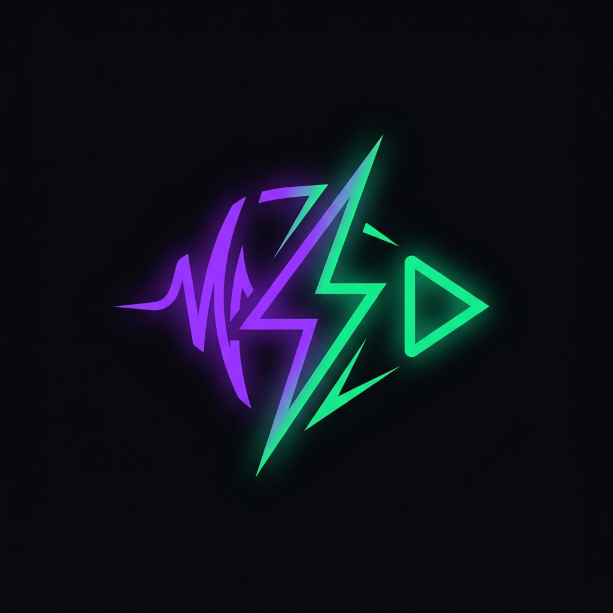
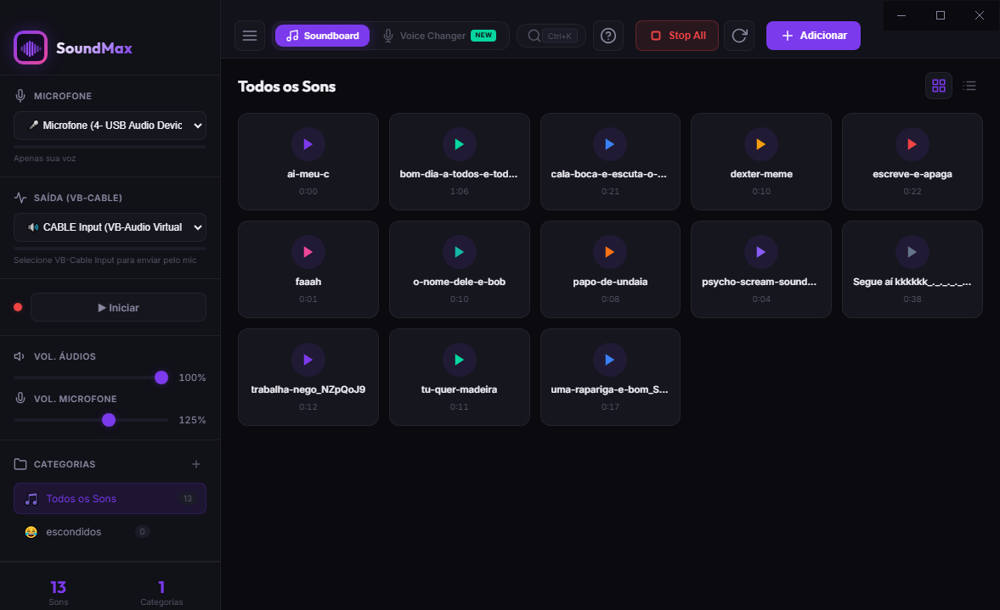

<div align="center">
  
  <h1>SoundMax — Premium Soundboard & Voice Changer</h1>
  <p><strong>Um Soundboard profissional e Modificador de Voz em tempo real com baixíssima latência, projetado para Gamers, Streamers e Criadores de Conteúdo.</strong></p>
  
  [](https://opensource.org/licenses/MIT)
  [](#)
  [](#)

  <hr>
</div>

## 📸 Demonstração do Aplicativo



---

## ✨ Recursos Principais (v2.2)

*   **🎙️ DSP Voice Changer (Novo!):** Mude sua voz em tempo real! Escolha entre efeitos como **Robô**, **Voz Grave**, **Megafone**, **Rádio**, **Chipmunk**, **Reverb** ou crie seu efeito **Customizado** ajustando Pitch, Reverb e Distorção individualmente.
*   **🎹 Teclas de Atalho Customizáveis (Novo!):** Defina hotkeys personalizadas para **ativar/desativar cada efeito de voz**. Basta clicar com o botão direito no card do efeito e pressionar a tecla que deseja usar!
*   **⚡ Web Audio API Nativa:** Motor de áudio totalmente reescrito sem PortAudio ou C++. Latência zero e imune a travamentos de exclusividade de driver do Windows.
*   **📂 Biblioteca de Áudio Inteligente:** Arraste e solte seus MP3s, WAVs ou OGGs no grid! O app gerencia e sincroniza tudo em uma pasta portátil interna automaticamente.
*   **🎨 Design Premium Dark:** Visual moderno e sofisticado construído com CSS Vanilla, com suporte a micro-animações, layout responsivo e visualizadores RMS (VU Meter) dinâmicos integrados para entrada e saída.
*   **⌨️ Atalhos Globais no Soundboard:** Toque seus sons favoritos pressionando teclas de atalho mesmo estando dentro do seu jogo em tela cheia.
*   **🎛️ Mixagem Inteligente:** Escute o retorno dos seus memes localmente enquanto os envia perfeitamente mixados com a sua voz para o Discord.

---

## 🛠️ Arquitetura de Código (Modular)

Na versão **v2.2**, realizamos uma refatoração massiva para transformar o aplicativo em um sistema de alta engenharia, dividindo o código monolítico em módulos com responsabilidades únicas:

-   [`js/state.js`](file:///d:/estudos/SoundMax/js/state.js) - Gerenciamento do estado reativo do app e sincronização com o `localStorage`.
-   [`js/audio-engine.js`](file:///d:/estudos/SoundMax/js/audio-engine.js) - Roteamento da Web Audio API, conexões de microfone e mixers dinâmicos de áudio.
-   [`js/sound-manager.js`](file:///d:/estudos/SoundMax/js/sound-manager.js) - Decodificador binário de áudio e reprodutor de buffers de baixíssima latência.
-   [`js/ui.js`](file:///d:/estudos/SoundMax/js/ui.js) - Renderizador dinâmico de layouts, cards de sons, modais elegantes e toasts.
-   [`js/events.js`](file:///d:/estudos/SoundMax/js/events.js) - Central de manipulação de cliques, drag-and-drop e listeners globais.
-   [`js/vc-controller.js`](file:///d:/estudos/SoundMax/js/vc-controller.js) - Interface do modulador de voz, sliders e o sistema inteligente de gravação de atalhos.
-   [`js/app.js`](file:///d:/estudos/SoundMax/js/app.js) - Ponto de entrada (Orquestrador) que inicializa as conexões com segurança.

---

## 🚀 Como Instalar e Usar

### 1. Pré-Requisito (Obrigatório)
Para transmitir o áudio do aplicativo diretamente no canal de voz do seu jogo ou Discord, você precisa de uma linha de áudio virtual:
*   Baixe e instale gratuitamente o [VB-Audio Virtual Cable](https://vb-audio.com/Cable/).

### 2. Configurando o SoundMax
*   Faça o download do executável compactado na aba de **Releases** do repositório.
*   Extraia o arquivo `.zip` e execute o `SoundMax.exe`.
*   Nas configurações laterais do app:
    *   Em **Microfone**: Selecione o seu microfone físico real.
    *   Em **Saída (VB-CABLE)**: Selecione `CABLE Input`.
*   Clique em **▶ Iniciar**. O motor começará a misturar a sua voz e os áudios instantaneamente.

### 3. Configurando o Discord ou seu Jogo
*   Abra o Discord, vá em *Configurações de Voz e Vídeo*.
*   Altere o **Dispositivo de Entrada (Microfone)** para `CABLE Output (VB-Audio Virtual Cable)`.
*   *Dica:* Desative as opções de *Redução de Ruído* e *Cancelamento de Eco* do Discord para que seus efeitos de voz e memes toquem com máxima qualidade de estúdio!

---

## 💻 Para Desenvolvedores (Rodar localmente)

Faça o clone do repositório e configure seu ambiente local:

```bash
# Instale as dependências de desenvolvimento
npm install

# Inicie o app em modo de desenvolvimento hot-reload
npm start

# Empacote o aplicativo criando um instalador Windows nativo (.exe e portable)
npm run package
```

---

## 📝 Licença

Desenvolvido com carinho por **Tony Max**. Projeto sob a licença MIT. Sinta-se à vontade para enviar issues, fazer forks e propor pull requests!
