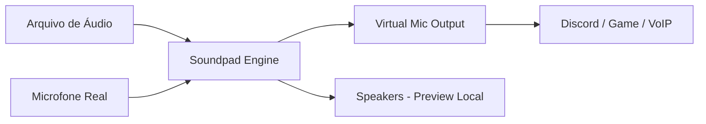
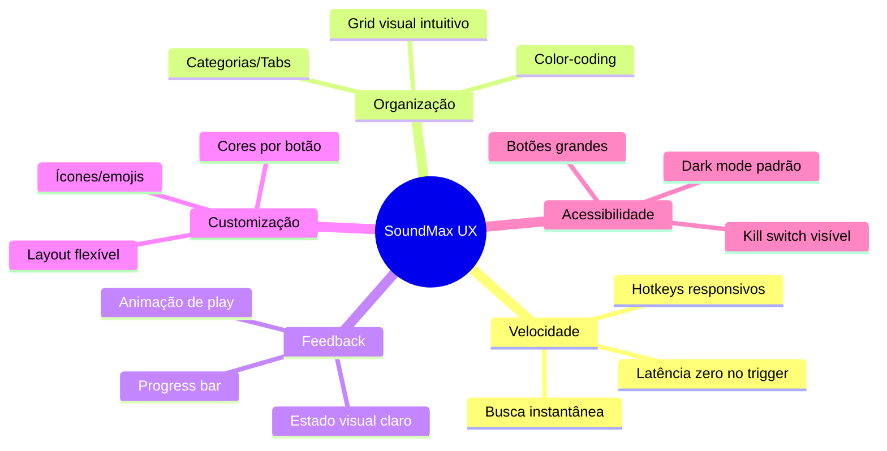
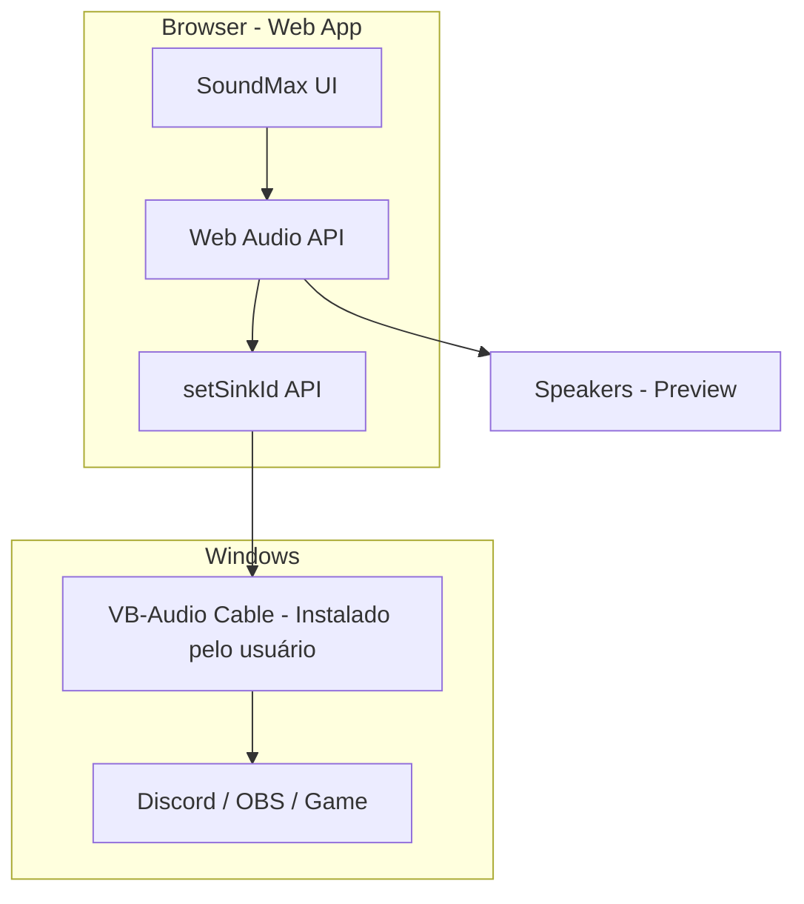
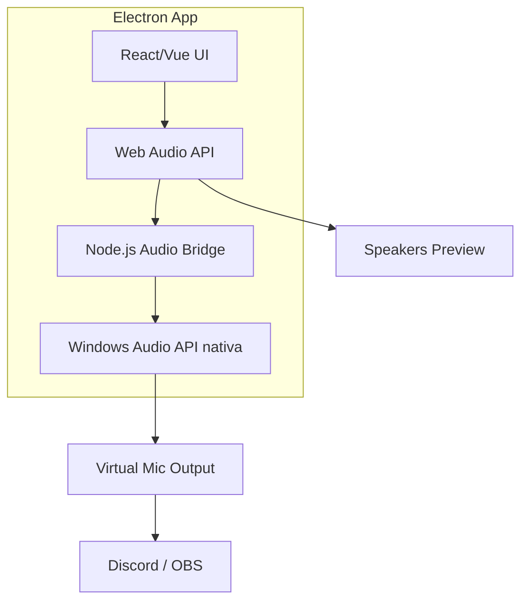

# 🔊 SoundMax — Análise Completa do Projeto

> [!IMPORTANT]
> Este documento consolida toda a pesquisa de mercado, análise técnica, projetos open-source e diretrizes de UI/UX para construir o **SoundMax** — um soundboard premium, bonito e funcional.

---

## 📋 Índice

1. [Como o Soundpad Funciona](#1-como-o-soundpad-funciona)
2. [Análise de Concorrentes](#2-análise-de-concorrentes)
3. [Projetos Open-Source no GitHub](#3-projetos-open-source-no-github)
4. [Features que Usuários Amam](#4-features-que-usuários-amam)
5. [Boas Práticas de UI/UX para Soundboards](#5-boas-práticas-de-uiux)
6. [Arquitetura Técnica Recomendada](#6-arquitetura-técnica-recomendada)
7. [Plano de Implementação](#7-plano-de-implementação)

---

## 1. Como o Soundpad Funciona

### Conceito Core
O Soundpad **injeta áudio diretamente no stream do microfone** do Windows. Quando você dispara um som, ele é mixado ao sinal do seu mic, fazendo com que outros ouçam o áudio em Discord, TeamSpeak, CS:GO, etc.

### Fluxo Técnico



### Mecanismo de Funcionamento
| Componente | Descrição |
|:---|:---|
| **Hook no Driver de Áudio** | Intercepta o stream do mic via Windows Audio API |
| **Modos de Reprodução** | Apenas speakers, apenas mic, ou ambos simultaneamente |
| **Block Voice** | Muta o mic real enquanto o som toca (evita sobreposição) |
| **Volume Normalization** | Equaliza volume dos sons para combinar com a voz |
| **Hotkeys** | Atalhos de teclado/mouse para disparo rápido |
| **Formatos Suportados** | MP3, WAV, AAC, FLAC, M4A, OGG, OPUS, WMA |

> [!NOTE]
> O Soundpad é escrito em **C++** nativo, consumindo recursos mínimos. Ele se instala como extensão do microfone existente via Windows Audio Drivers.

---

## 2. Análise de Concorrentes

### Comparação Direta

| Feature | Soundpad | Voicemod | Resanance | EXP Soundboard |
|:---|:---:|:---:|:---:|:---:|
| **Preço** | $4.99 (único) | Freemium/Assinatura | Grátis | Grátis/Open-Source |
| **Voice Changer** | ❌ | ✅ Robusto | ❌ | ❌ |
| **Gravador Integrado** | ✅ | ❌ | ❌ | ❌ |
| **Editor de Áudio** | ✅ | ❌ | ❌ | ❌ |
| **Normalização de Volume** | ✅ | Parcial | ❌ | ❌ |
| **Hotkeys** | ✅ | ✅ | ✅ | ✅ |
| **Peso/Performance** | Ultra leve | Pesado | Leve | Leve |
| **Plataformas** | Windows | Windows + Mobile | Windows | Win/Mac/Linux |
| **Integração Stream** | Básica | OBS/Twitch/Elgato | ❌ | ❌ |
| **Text-to-Speech** | ❌ | ✅ | ✅ | ❌ |
| **Dark Mode** | ❌ | ✅ | ❌ | ❌ |

### Pontos Fortes de Cada Um

**Soundpad** — Confiabilidade, simplicidade, normalização de volume, editor integrado.

**Voicemod** — Ecossistema rico, voice changer, integração streaming, UI moderna.

**Resanance** — Gratuito, leve, TTS, controle individual de volume por som.

**EXP Soundboard** — Cross-platform, open-source, altamente customizável.

---

## 3. Projetos Open-Source no GitHub

### 🏆 Top Projetos Relevantes

| Projeto | ⭐ Stars | Linguagem | Destaques |
|:---|:---:|:---:|:---|
| [Soundux/Soundux](https://github.com/Soundux/Soundux) | **2.000+** | C++ | Cross-platform, UI moderna, VB-Cable, PulseAudio/PipeWire |
| [MattMoony/figaro](https://github.com/MattMoony/figaro) | **981** | Python | Voice changer real-time, CLI + GUI, filtros de voz |
| [2ec0b4/kaamelott-soundboard](https://github.com/2ec0b4/kaamelott-soundboard) | **438** | JavaScript | Web-based, simples, bom exemplo de UI de grid |
| [markokajzer/discord-soundbot](https://github.com/markokajzer/discord-soundbot) | **197** | TypeScript | Bot Discord, gerenciamento de sons via comandos |
| [ruohki/lunchpad](https://github.com/ruohki/lunchpad) | **152** | Rust | Integração Launchpad/StreamDeck, OBS, macros |
| [dan0v/AmplitudeSoundboard](https://github.com/dan0v/AmplitudeSoundboard) | **145** | C# | Cross-platform, Avalonia UI, hotkeys globais |
| [Glecun/soundboard](https://github.com/Glecun/soundboard) | **37** | TypeScript | **Electron + React**, boa referência para nosso stack |
| [Tom4nt/Mega-Soundboard](https://github.com/Tom4nt/Mega-Soundboard) | **20** | TypeScript | **Electron**, keybinds, organização por pastas |
| [gamebooster/soundboard](https://github.com/gamebooster/soundboard) | **74** | Rust | Cross-platform desktop, conferências |

### O Que Podemos Aproveitar

> [!TIP]
> Os projetos mais relevantes para o nosso caso são:
> - **Soundux** — Arquitetura de roteamento de áudio e UI moderna
> - **Glecun/soundboard** — Stack Electron + React + TypeScript (mesma que vamos usar)
> - **Mega-Soundboard** — Sistema de keybinds e organização por pastas/tabs
> - **AmplitudeSoundboard** — UX de hotkeys globais e controles de volume

---

## 4. Features que Usuários Amam

### 🔥 Prioridade CRÍTICA (MVP)

| # | Feature | Justificativa |
|:---:|:---|:---|
| 1 | **Grid de Sons Customizável** | Core da experiência — botões coloridos, reordenáveis |
| 2 | **Hotkeys Globais** | Disparar sons sem sair do jogo/app |
| 3 | **Roteamento de Áudio** | Enviar som pelo mic virtual (VB-Cable / setSinkId) |
| 4 | **3 Modos de Play** | Apenas local, apenas mic, ou ambos |
| 5 | **Drag & Drop de Arquivos** | Importação intuitiva de áudios |
| 6 | **Busca/Filtro Rápido** | Encontrar sons em bibliotecas grandes |
| 7 | **Stop All / Kill Switch** | Parar todos os sons instantaneamente |
| 8 | **Volume Global + Individual** | Controle granular por som e master |

### ⭐ Prioridade ALTA (v1.1)

| # | Feature | Justificativa |
|:---:|:---|:---|
| 9 | **Pastas/Categorias/Tabs** | Organizar sons por tema (Memes, Música, Efeitos) |
| 10 | **Normalização de Volume** | Equalizar sons automaticamente |
| 11 | **Gravador Integrado** | Capturar "o que você ouve" no PC |
| 12 | **Editor de Áudio Básico** | Trim, fade-in/out, sem sair do app |
| 13 | **Favoritos / Pins** | Acesso rápido aos sons mais usados |
| 14 | **Indicadores Visuais de Play** | Animação/highlight no botão tocando, barra de progresso |
| 15 | **Dark/Light Theme** | Preferência do usuário (Dark padrão) |

### 💎 Prioridade DESEJÁVEL (v2.0)

| # | Feature | Justificativa |
|:---:|:---|:---|
| 16 | **Text-to-Speech** | Gerar fala a partir de texto digitado |
| 17 | **Soundboard Profiles** | Trocar sets de sons por contexto (gaming, streaming) |
| 18 | **Import/Export de Configs** | Compartilhar setups com amigos |
| 19 | **Integração OBS/StreamDeck** | Controle via hardware externo |
| 20 | **Biblioteca Online** | Baixar sons de uma comunidade |
| 21 | **Efeitos em Tempo Real** | Reverb, pitch, echo nos sons |
| 22 | **Random Play** | Tocar som aleatório de uma categoria |
| 23 | **Loop Mode** | Repetir som continuamente |
| 24 | **Overlap Control** | Configurar se sons podem sobrepor ou cancelar anterior |

---

## 5. Boas Práticas de UI/UX

### Princípios Fundamentais



### Checklist de Design

| Princípio | Implementação |
|:---|:---|
| **Low Latency** | Web Audio API com buffers pré-carregados, latência < 50ms |
| **One-Click Access** | Sons favoritos sempre visíveis, sem menus profundos |
| **Visual Hierarchy** | Grid principal dominante, controles secundários no sidebar |
| **Responsive Feedback** | Botão pulsa/brilha ao tocar, waveform animada |
| **Dark Mode Default** | Gamers/streamers usam em ambientes escuros |
| **Drag & Drop** | Arrastar arquivos direto para o grid |
| **Global Stop** | Botão vermelho grande e sempre visível |
| **Search First** | Barra de busca no topo, filtragem em tempo real |

### Design System Proposto

**Paleta de Cores (Dark Theme):**
- Background: `#0D0D0D` → `#1A1A2E`
- Surfaces: `#16213E` → `#1A1A2E`
- Primary Accent: `#7C3AED` (Violet)
- Secondary: `#06D6A0` (Mint)
- Danger/Stop: `#EF4444`
- Text Primary: `#F8FAFC`
- Text Secondary: `#94A3B8`

**Tipografia:** Inter / Outfit (Google Fonts)

**Efeitos Visuais:**
- Glassmorphism nos painéis
- Glow neon nos botões ativos
- Micro-animações (pulse, ripple, scale)
- Gradientes sutis nos cards de som

---

## 6. Arquitetura Técnica Recomendada

### Abordagem: Web App + Roteamento de Áudio

> [!IMPORTANT]
> Existem **duas abordagens** possíveis. A decisão depende do nível de integração desejado.

### Opção A: Web App Puro (Recomendada para MVP)



**Prós:** Desenvolvimento rápido, UI rica com HTML/CSS/JS, sem instalação complexa
**Contras:** Usuário precisa instalar VB-Cable separadamente, limitado ao browser

### Opção B: Electron App (Recomendada para v2.0)



**Prós:** Controle total, hotkeys globais nativos, sem dependência de VB-Cable
**Contras:** Maior complexidade, bundle maior

### Tech Stack Recomendado (MVP - Web App)

| Camada | Tecnologia |
|:---|:---|
| **Frontend** | HTML5 + CSS3 + JavaScript Vanilla |
| **Áudio** | Web Audio API + `setSinkId()` |
| **Storage** | IndexedDB (sons) + LocalStorage (config) |
| **Design** | CSS Custom Properties + Glassmorphism |
| **Fontes** | Google Fonts (Inter/Outfit) |
| **Ícones** | Lucide Icons ou Phosphor Icons |

### APIs Chave do Browser

```javascript
// 1. Listar dispositivos de áudio
const devices = await navigator.mediaDevices.enumerateDevices();
const outputs = devices.filter(d => d.kind === 'audiooutput');

// 2. Rotear áudio para dispositivo virtual
const audio = new Audio('sound.mp3');
await audio.setSinkId(virtualCableDeviceId);
audio.play();

// 3. Web Audio API para controle avançado
const ctx = new AudioContext();
const source = ctx.createBufferSource();
const gainNode = ctx.createGain(); // Volume individual
source.connect(gainNode).connect(ctx.destination);
```

---

## 7. Plano de Implementação

### Fase 1 — MVP (Semana 1-2)

- [ ] Setup do projeto (HTML/CSS/JS)
- [ ] Design System completo (cores, tipografia, componentes)
- [ ] Grid de soundboard com botões customizáveis
- [ ] Drag & Drop para importar áudios
- [ ] Player com Web Audio API
- [ ] Seleção de dispositivo de saída (setSinkId)
- [ ] Volume global + individual por som
- [ ] Botão Stop All
- [ ] Busca/filtro de sons
- [ ] Dark theme com glassmorphism
- [ ] Persistência em LocalStorage/IndexedDB

### Fase 2 — Polimento (Semana 3)

- [ ] Sistema de categorias/tabs
- [ ] Hotkeys (keyboard shortcuts)
- [ ] Normalização de volume
- [ ] Animações de feedback (play, loading, waveform)
- [ ] Favoritos/Pins
- [ ] Import/Export de configuração
- [ ] Light theme alternativo

### Fase 3 — Features Avançadas (Semana 4+)

- [ ] Gravador integrado (MediaRecorder API)
- [ ] Editor de áudio básico (trim, fade)
- [ ] Text-to-Speech (SpeechSynthesis API)
- [ ] Profiles de soundboard
- [ ] Loop mode + Random play
- [ ] Migração para Electron (opcional)

---

## 🎯 Decisões Pendentes

> [!WARNING]
> Preciso da sua opinião sobre os seguintes pontos:

1. **Web App puro ou Electron?** — Web App é mais rápido de desenvolver e já fica bonito. Electron dá mais controle mas é mais complexo.

2. **Qual nome final?** — "SoundMax" está bom ou prefere outro?

3. **Quais features do MVP são prioridade absoluta pra você?** — Grid + Play + Device Selection é o mínimo. Quer hotkeys já no MVP?

4. **Vai usar VB-Cable?** — Se sim, o Web App puro já resolve. Se não quer dependência externa, precisamos de Electron.

5. **Alguma referência visual** que você gosta? (Soundpad, Voicemod, ou outro app que acha bonito?)
