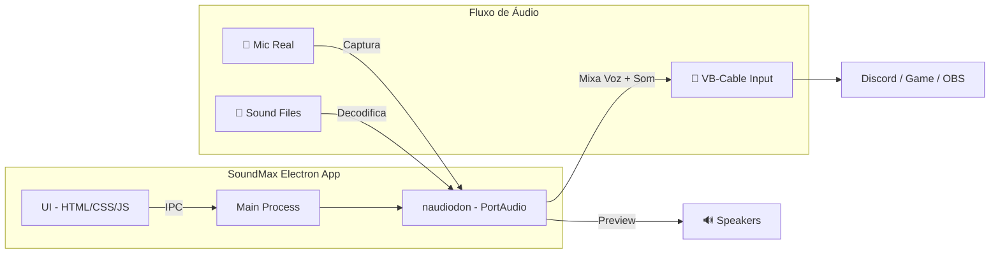

# 🔊 SoundMax v2 — Plano de Reconstrução

> [!IMPORTANT]
> Novo plano com **áudio nativo** via PortAudio para mixar voz + sons no microfone virtual.

## Arquitetura Nova

## O que muda

| Antes (v1) | Agora (v2) |
|:---|:---|
| Web Audio API (browser) | PortAudio nativo via `naudiodon` |
| Usuário configura tudo manual | Auto-detecção de VB-Cable |
| Sem mixagem voz+som | **Mixa mic real + sons em tempo real** |
| Áudio só no browser | Áudio direto nos devices do Windows |
| Sem setup wizard | Wizard de primeira execução |

## Stack Técnico

- **Electron** — Desktop app
- **naudiodon** — Bindings PortAudio para Node.js (captura mic + output device)
- **fluent-ffmpeg / audiobuffer-utils** — Decodificar MP3/WAV para PCM raw
- **IPC** — Comunicação UI ↔ Audio Engine
- **HTML/CSS/JS** — UI premium (mantemos o design)

## Features MVP v2

1. ✅ Auto-detectar VB-Cable
2. ✅ Capturar microfone real
3. ✅ Mixar voz + sons em tempo real
4. ✅ Output para VB-Cable automaticamente
5. ✅ Preview local nos speakers
6. ✅ Carregar pasta de áudios (`d:\downloads\audios`)
7. ✅ Grid bonito com todos os sons
8. ✅ Hotkeys globais
9. ✅ Volume master + individual
10. ✅ Stop All (Esc)
